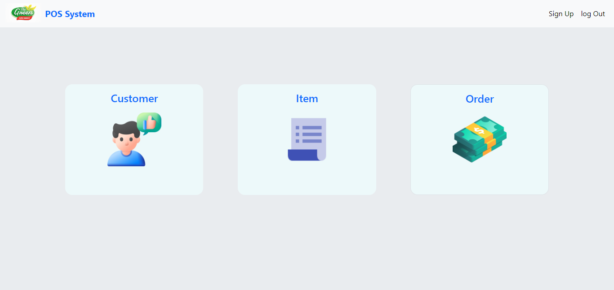
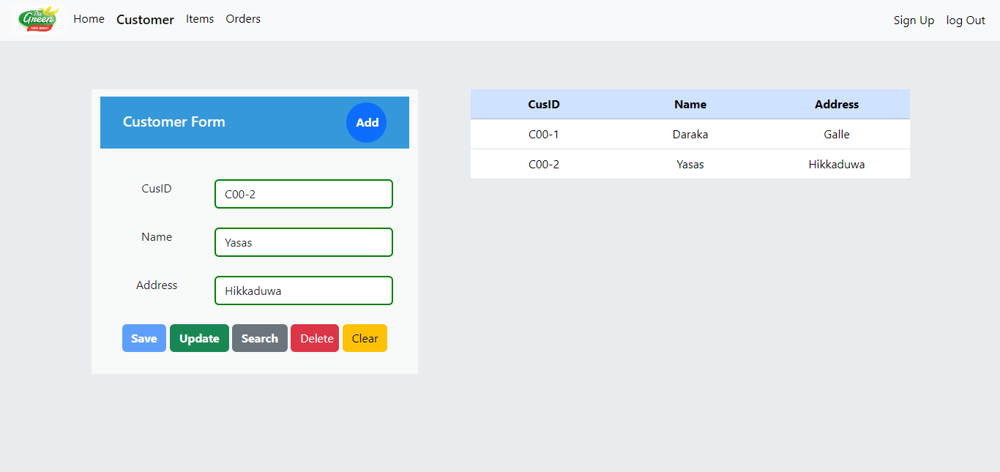
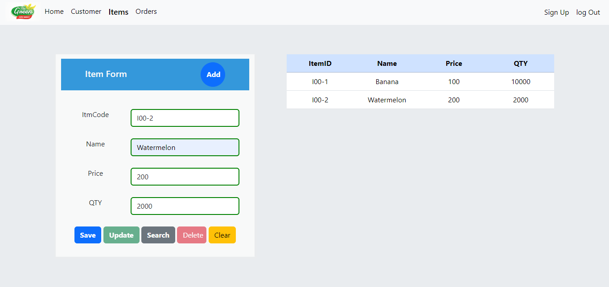
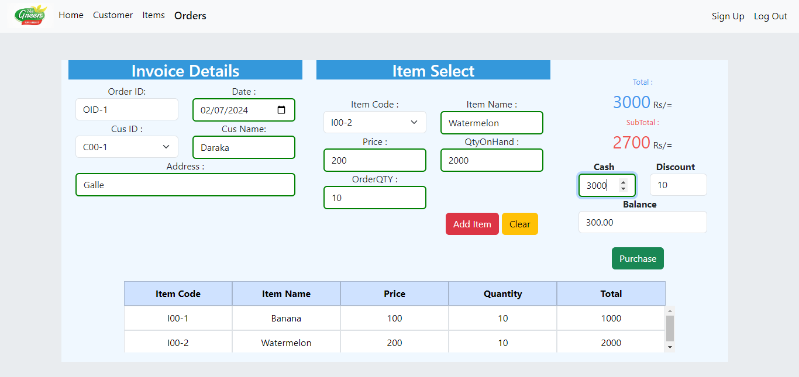

# Super Market Management System

The Super Market Management System offers a range of features to enhance the order process.

🎗️𝗧𝗲𝗰𝗵𝗻𝗼𝗹𝗼𝗴𝘆 𝘀𝘁𝗮𝗰𝗸
☑️Spring
☑️HTML
☑️CSS
☑️JavaScript 
☑️Layeered Architecture

## Features

- Dashboard

- Customers Manage

- Items Manage

- Orders Manage 

